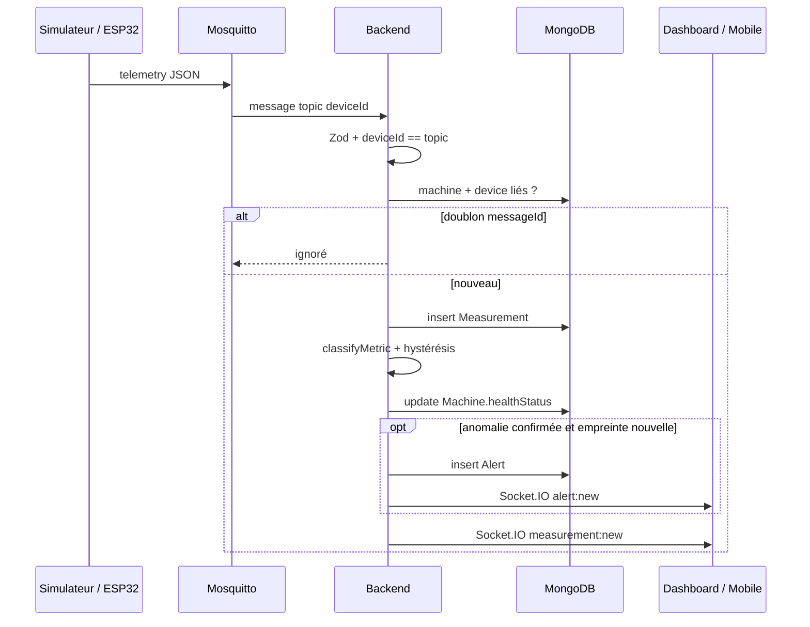

# Séquence : mesure → alerte

```mermaid
sequenceDiagram
  participant Sim as Simulateur / ESP32
  participant MQTT as Mosquitto
  participant API as Backend
  participant DB as MongoDB
  participant UI as Dashboard / Mobile

  Sim->>MQTT: telemetry JSON
  MQTT->>API: message topic deviceId
  API->>API: Zod + deviceId == topic
  API->>DB: machine + device liés ?
  alt doublon messageId
    API-->>MQTT: ignoré
  else nouveau
    API->>DB: insert Measurement
    API->>API: classifyMetric + hystérésis
    API->>DB: update Machine.healthStatus
    opt anomalie confirmée et empreinte nouvelle
      API->>DB: insert Alert
      API->>UI: Socket.IO alert:new
    end
    API->>UI: Socket.IO measurement:new
  end
```

MongoDB reste la source de vérité. Socket.IO ne fait que notifier.
